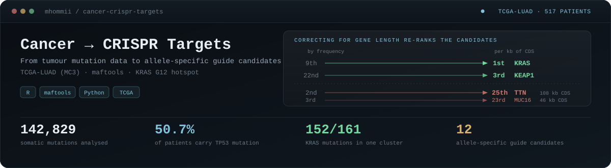
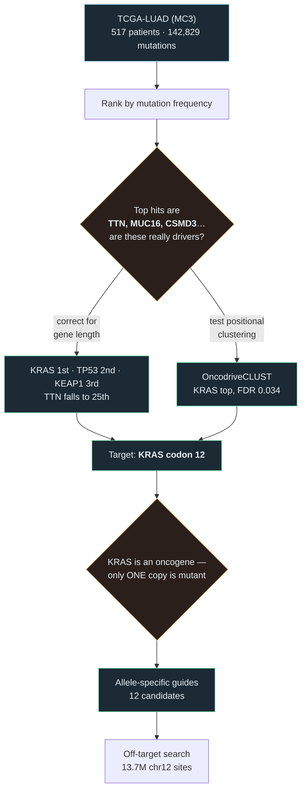
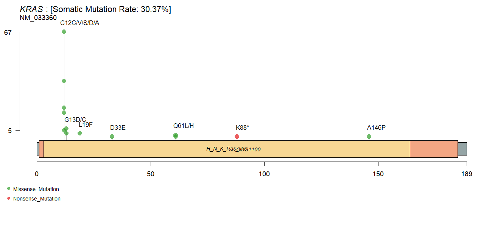
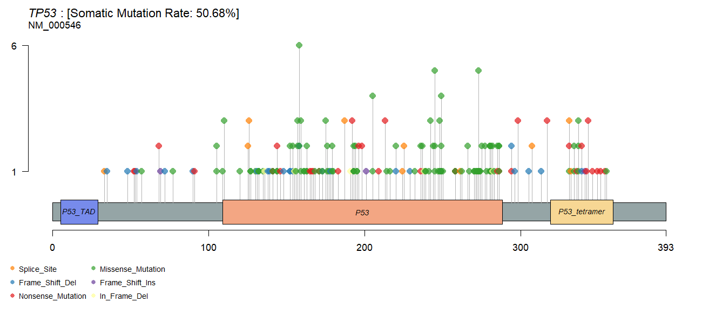
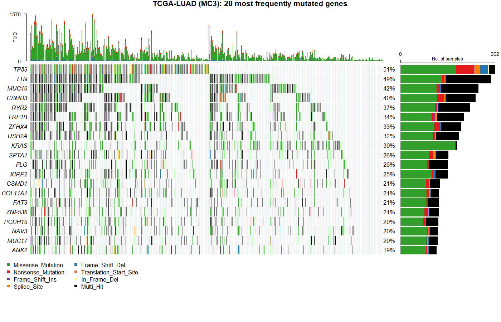

<div align="center">



<br>


**From real tumour mutation data to CRISPR guide candidates — including the step where you check whether the obvious answer is actually right.**

[**📄 Read the full write-up →**](report.md)

</div>

> [!NOTE]
> **How this was made.** A guided learning project built and run with Claude Code (an AI assistant), which wrote the code and explanations and executed each step. It is a learning exercise, not independent research. The *My notes* sections are mine to fill in.

---

## The route



---

## The obvious answer is wrong

Rank genes by how many patients carry a mutation and you get this:

| Rank | Gene | Patients | % of cohort | |
|:--:|---|--:|--:|---|
| 1 | **TP53** | 262 | 50.7% | ✅ genuine driver |
| 2 | TTN | 251 | 48.5% | ⚠️ 108 kb of coding sequence |
| 3 | MUC16 | 216 | 41.8% | ⚠️ 46 kb |
| 4 | CSMD3 | 208 | 40.2% | ⚠️ 11 kb |
| 5 | RYR2 | 193 | 37.3% | ⚠️ 15 kb |
| 9 | **KRAS** | 157 | 30.4% | ✅ genuine driver, buried |

TTN encodes **titin, the largest human protein** — the longest annotated transcript here carries 107,976 bp of coding sequence, about 36,000 residues. A gene with a hundred times the coding sequence collects roughly a hundred times the passenger mutations. Raw frequency rewards size, not importance ([Lawrence et al. 2013](https://doi.org/10.1038/nature12213)).

### Correcting for length

<table>
<tr><th colspan="2">Rises ▲</th><th colspan="2">Falls ▼</th></tr>
<tr>
<td><b>KRAS</b><br><sub>0.6 kb CDS</sub></td><td>9th → <b>1st</b></td>
<td><b>TTN</b><br><sub>108.0 kb CDS</sub></td><td>2nd → <b>25th</b></td>
</tr>
<tr>
<td><b>KEAP1</b><br><sub>1.9 kb CDS</sub></td><td>22nd → <b>3rd</b></td>
<td><b>MUC16</b><br><sub>46.5 kb CDS</sub></td><td>3rd → <b>23rd</b></td>
</tr>
<tr>
<td><b>TP53</b><br><sub>1.2 kb CDS</sub></td><td>1st → <b>2nd</b></td>
<td><b>USH2A</b><br><sub>15.6 kb CDS</sub></td><td>8th → <b>18th</b></td>
</tr>
</table>

> [!TIP]
> **KEAP1 rising from 22nd to 3rd is the check that matters.** It is a genuine, well-described lung adenocarcinoma driver that raw frequency buried. If the correction only shuffled genes around, that would not happen.


*Drivers sit top-left (short, densely mutated). Length artefacts sit bottom-right (long, sparsely mutated). Bubble size is the number of patients.*

---

## Two kinds of driver, visible in the data

Length correction is crude. [OncodriveCLUST](https://doi.org/10.1093/bioinformatics/btt395) asks a sharper question: are a gene's mutations **piled up at the same residues**, or scattered?

| | Oncogene | Tumour suppressor |
|---|---|---|
| Mutation pattern | Clustered at specific residues | Scattered along the protein |
| Mutation type | Mostly missense | Often truncating (nonsense, frameshift) |
| Why | Only certain substitutions switch it *on* | Any change that *breaks* it will do |
| Example here | **KRAS** — 152/161 mutations in one cluster | **TP53** |
| CRISPR approach | Must spare the normal copy | Knockout is reasonable |



**KRAS**: **143 of its 161 mutations sit at codon 12**, with G12C alone accounting for 67 patients, then G12V (36), G12D (19) and G12A (16). After that, G13 and Q61 — the classic RAS hotspots, nearly all missense. OncodriveCLUST puts KRAS top with FDR 0.034, 152 of 161 mutations in a single cluster.

<details>
<summary><b>The contrasting TP53 pattern, and the full oncoplot</b></summary>

<br>



TP53's mutations are spread along the protein with many truncating changes — a gene being broken, not switched on.



The oncoplot shows the same thing per patient: TP53's row carries nonsense, splice and frameshift colours; KRAS's row is almost entirely missense green.

</details>

---

## Why KRAS needs a different guide design

This is the core of the project.

```text
  TUMOUR SUPPRESSOR                        ONCOGENE
  ─────────────────                        ────────

  TP53  ▸ already broken in the tumour     KRAS  ▸ driven by ONE mutant copy
        ▸ disrupt it further               ▸ other copy is normal
        ▸ cut anywhere in early CDS        ▸ healthy cells NEED that copy
                                           ▸ a guide matching both
        →  knockout design                    would cut the normal one too

                                           →  must tell one base apart
```

Whether that is possible depends on **where the changed base sits relative to the PAM**, because Cas9 tolerates mismatches poorly in the ~12 bases next to it.

```text
     mutant allele   C T T G T G G T A G T T G G A G C T G C | T G G
     wild-type       C T T G T G G T A G T T G G A G C T G G | T G G
                                                           ▲
                                            one base, adjacent to the PAM
```

### Candidate guides

| Mutation | Guide (mutant allele) | PAM | Distance from PAM | Off-targets chr12 (≤4 mm) |
|---|---|:--:|:--:|:--:|
| **G12A** | `CTTGTGGTAGTTGGAGCTGC` | TGG | **0** | 8 |
| **G12D** | `CTTGTGGTAGTTGGAGCTGA` | TGG | **0** | 11 |
| **G12V** | `CTTGTGGTAGTTGGAGCTGT` | TGG | **0** | 9 |
| G12C | `CTTGTGGTAGTTGGAGCTTG` | TGG | 1 | 10 |
| G12R | `CTTGTGGTAGTTGGAGCTCG` | TGG | 1 | 3 |
| G12S | `CTTGTGGTAGTTGGAGCTAG` | TGG | 1 | 7 |

Distance 0 means the changed base sits directly against the PAM — the most favourable position for discrimination.

> **One guide per substitution is shown above** — the `TGG`-PAM guide whose mismatch sits closest to the PAM. Each substitution also has a second candidate on the `AGG` PAM further along, with the change 6–7 bases from the PAM. That makes **12 candidates in total**; all of them are in [`results/kras_guide_offtargets.tsv`](results/kras_guide_offtargets.tsv).

Two findings worth stating plainly:

- **Only two PAMs place a protospacer over codon 12.** The region is PAM-poor. That is a real constraint on allele-specific KRAS editing, not an oversight in the search.
- **No codon-12 substitution creates a new PAM.** That would be the strongest discrimination available — Cas9 cannot cut an allele with no PAM at all — and none of these mutations provides it.

> [!IMPORTANT]
> ### The wild-type allele *is* the off-target
>
> Every one of these guides has **exactly one single-mismatch site on chromosome 12 — and it is the KRAS locus itself.** The normal copy of the gene, in every healthy cell. Verified by coordinate for all 12 guides.
>
> That is not a flaw to be filtered away. **It is the design problem.** The question is never whether a guide has an off-target here — it does, unavoidably, by construction. The question is whether one mismatch, in that position, is enough for Cas9 to cut the mutant and spare the normal copy.

---

## Checks built in

Each step stops rather than producing quietly wrong numbers. One of them caught a real bug during development.

<table>
<tr><th>Step</th><th>Check</th><th>What it caught</th></tr>
<tr>
<td align="center"><b>2</b></td>
<td>TTN must have the longest CDS in the table</td>
<td>🐛 <b>Real bug.</b> Taking the first RefSeq hit per gene returned <b>444 bp</b> for TTN instead of ~108,000 — which <i>inverted the entire length argument</i>, putting TTN top by density. Fixed by taking the longest annotated CDS across transcripts.</td>
</tr>
<tr>
<td align="center"><b>4</b></td>
<td>KRAS codon 12 must read <code>GGT</code> (glycine)</td>
<td>Guards the transcript→genome coordinate mapping. KRAS is on the minus strand; an error here would design guides against the wrong codon while looking perfectly fine.</td>
</tr>
<tr>
<td align="center"><b>5</b></td>
<td>No mutant-allele guide may match the reference exactly</td>
<td>The reference genome carries wild-type KRAS, so a mutant guide must not match it perfectly. ✅ 0 of 12 do.</td>
</tr>
<tr>
<td align="center"><b>5</b></td>
<td>Each guide's 1-mismatch site must be the KRAS locus</td>
<td>Confirms the wild-type allele is being detected where expected. ✅ 12 of 12, by coordinate.</td>
</tr>
</table>

---

## Pipeline

| Step | Script | Does | Runtime |
|:--:|---|---|---|
| 1 | [`01_mutation_landscape.R`](steps/01_mutation_landscape.R) | Load TCGA-LUAD MC3; oncoplot and top mutated genes | ~1 min |
| 2 | [`02_normalise_and_choose_target.py`](steps/02_normalise_and_choose_target.py) | Correct for gene length; fetch CDS lengths from NCBI | ~2 min |
| 3 | [`03_positional_clustering.R`](steps/03_positional_clustering.R) | OncodriveCLUST; lollipop plots | ~10 min |
| 4 | [`04_design_allele_specific_guides.py`](steps/04_design_allele_specific_guides.py) | Guides against the KRAS codon-12 hotspot | seconds |
| 5 | [`05_offtarget_and_report.py`](steps/05_offtarget_and_report.py) | Off-target search on chr12; build the report | ~2 min |

<details>
<summary><b>Running it</b></summary>

<br>

```r
# R packages
BiocManager::install("maftools")
BiocManager::install("PoisonAlien/TCGAmutations")
```

```powershell
# R side
Rscript steps\01_mutation_landscape.R
Rscript steps\03_positional_clustering.R     # several minutes

# Python side
py -m venv .venv
.venv\Scripts\python.exe -m pip install -r requirements.txt
$env:NCBI_EMAIL = "you@example.com"   # NCBI requires a contact address

.venv\Scripts\python.exe steps\02_normalise_and_choose_target.py
.venv\Scripts\python.exe steps\04_design_allele_specific_guides.py
# step 5 needs chr12 (~38 MB) as data/chr12.fa.gz, from Ensembl:
#   https://ftp.ensembl.org/pub/current_fasta/homo_sapiens/dna/
.venv\Scripts\python.exe steps\05_offtarget_and_report.py
```

The off-target search reuses the bit-packed method from [crispr-guide-design](https://github.com/mhommii/crispr-guide-design) (`steps/offtarget.py`, copied with attribution so this repo runs standalone).

</details>

---

## My notes

*(to be written by me)*

### On the gene-length artefact

### On oncogenes versus tumour suppressors

### On allele-specific targeting

---

## Limitations

> [!WARNING]
> These matter, and the results above should not be read without them.

- **Nothing here is validated.** These are sequence analyses. No guide has been tested, and none is a recommendation for any use.
- **Recurrent mutation is not dependency.** A gene being mutated often does not show the tumour *needs* it. That requires functional work, such as a CRISPR screen.
- **Length correction is crude.** Mutations per kb ignores sequence context, replication timing and expression — all of which [MutSigCV](https://doi.org/10.1038/nature12213) models properly. It is used here to demonstrate the effect, not as a substitute.
- **One chromosome.** Off-target search covers chr12 only (~4.3% of the genome), and searches mismatches but not bulges.
- **Discrimination is predicted from position alone.** Whether one mismatch is actually enough depends on the guide, the chromatin context and the Cas9 variant used.
- **Reference sources differ between projects.** chr12 here comes from Ensembl (UCSC was unreachable); the companion project used UCSC hg38. Both are GRCh38 primary assembly, so coordinates agree.

---

## References

| Source | |
|---|---|
| Ellrott, K. et al. (2018) | Scalable Open Science Approach for Mutation Calling of Tumor Exomes Using Multiple Genomic Pipelines. *Cell Systems*. [10.1016/j.cels.2018.03.002](https://doi.org/10.1016/j.cels.2018.03.002) |
| Mayakonda, A. et al. (2018) | Maftools: efficient and comprehensive analysis of somatic variants in cancer. *Genome Research*. [10.1101/gr.239244.118](https://doi.org/10.1101/gr.239244.118) |
| Lawrence, M. S. et al. (2013) | Mutational heterogeneity in cancer and the search for new cancer-associated genes. *Nature*. [10.1038/nature12213](https://doi.org/10.1038/nature12213) |
| Tamborero, D. et al. (2013) | OncodriveCLUST: exploiting the positional clustering of somatic mutations to identify cancer genes. *Bioinformatics*. [10.1093/bioinformatics/btt395](https://doi.org/10.1093/bioinformatics/btt395) |
| Bae, S. et al. (2014) | Cas-OFFinder. *Bioinformatics*. [10.1093/bioinformatics/btu048](https://doi.org/10.1093/bioinformatics/btu048) |
| Cock, P. J. A. et al. (2009) | Biopython. *Bioinformatics*. [10.1093/bioinformatics/btp163](https://doi.org/10.1093/bioinformatics/btp163) |
| Sequence data | [NCBI Gene and RefSeq](https://www.ncbi.nlm.nih.gov/gene/) · chromosome 12 from [Ensembl GRCh38](https://ftp.ensembl.org/pub/current_fasta/homo_sapiens/dna/) |

<div align="center">
<sub>

Part of a bioinformatics portfolio → [roadmap](https://github.com/mhommii/bioinformatics-roadmap) · [crispr-guide-design](https://github.com/mhommii/crispr-guide-design) · [variant-calling-pipeline](https://github.com/mhommii/variant-calling-pipeline)

</sub>
</div>
