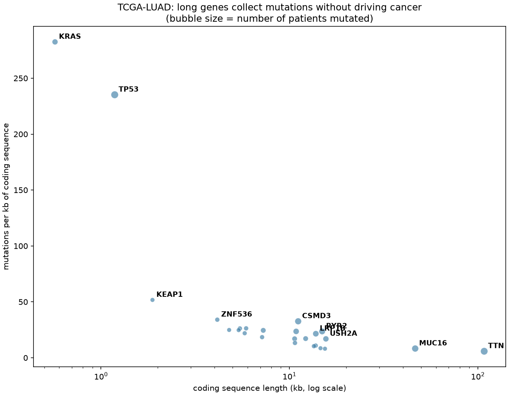

# From a cancer cohort to candidate CRISPR guides

A walk from public tumour mutation data to sequence-level guide candidates for the gene that analysis points at. Every number here was produced by the scripts in `steps/`.

## 1. What is mutated in lung adenocarcinoma

TCGA-LUAD (MC3 calls): **262 of 517 patients** carry a TP53 mutation, the most of any gene.

| Gene | Patients mutated | % of cohort |
|---|---|---|
| TP53 | 262 | 50.7% |
| TTN | 251 | 48.5% |
| MUC16 | 216 | 41.8% |
| CSMD3 | 208 | 40.2% |
| RYR2 | 193 | 37.3% |
| LRP1B | 176 | 34.0% |
| ZFHX4 | 169 | 32.7% |
| USH2A | 163 | 31.5% |

But that list is misleading. TTN, MUC16, CSMD3, RYR2 and USH2A are not lung cancer drivers - they are very large genes that accumulate passenger mutations in proportion to their length.

## 2. Correcting for gene length

Dividing by coding sequence length changes the ranking sharply:

| Gene | CDS (kb) | Mutations/kb | Rank by frequency | Rank by density |
|---|---|---|---|---|
| **KRAS** | 0.6 | 282 | 9 | 1 |
| **TP53** | 1.2 | 235 | 1 | 2 |
| **KEAP1** | 1.9 | 52 | 22 | 3 |
| **ZNF536** | 4.1 | 34 | 16 | 4 |
| **CSMD3** | 11.1 | 33 | 4 | 5 |

And the long genes fall away:

| Gene | CDS (kb) | Rank by frequency | Rank by density |
|---|---|---|---|
| TTN | 108.0 | 2 | 25 |
| MUC16 | 46.5 | 3 | 23 |
| USH2A | 15.6 | 8 | 18 |
| LRP1B | 13.8 | 6 | 14 |
| RYR2 | 14.9 | 5 | 11 |

KEAP1 rising from 22nd to 3rd is a useful check: it is a genuine, well-described lung adenocarcinoma driver that raw frequency buried.

## 3. Positional clustering

Length correction is crude. OncodriveCLUST asks a sharper question: are a gene's mutations piled up at the same residues? See `results/oncodrive_results.tsv`. KRAS comes out top, with almost all of its mutations in a single cluster at codon 12 - the signature of an oncogene hotspot. TP53's mutations are scattered and often truncating, the signature of a tumour suppressor.

## 4. Why KRAS needs allele-specific guides

TP53 is already broken in the tumour, so disrupting it further is a reasonable knockout design - that is what the [crispr-guide-design](https://github.com/mhommii/crispr-guide-design) project does. KRAS is the opposite case:

- it is an oncogene driven by **one** mutant copy,
- the other copy is normal and needed by healthy cells,
- so a guide matching both copies would cut the normal one too.

The design question becomes: can a guide tell one base apart? That depends on where the change sits relative to the PAM, because Cas9 tolerates mismatches poorly in the ~12 bases next to it.

## 5. Candidate guides

12 candidates across 6 codon-12 substitutions. Only two PAMs in the reference place a protospacer over codon 12, which is itself a practical finding - this region is PAM-poor.

| Mutation | Guide (mutant allele) | PAM | Distance from PAM | Off-targets on chr12 (≤4 mm) |
|---|---|---|---|---|
| G12A | `CTTGTGGTAGTTGGAGCTGC` | TGG | 0 | 8 |
| G12C | `CTTGTGGTAGTTGGAGCTTG` | TGG | 1 | 10 |
| G12D | `CTTGTGGTAGTTGGAGCTGA` | TGG | 0 | 11 |
| G12R | `CTTGTGGTAGTTGGAGCTCG` | TGG | 1 | 3 |
| G12S | `CTTGTGGTAGTTGGAGCTAG` | TGG | 1 | 7 |
| G12V | `CTTGTGGTAGTTGGAGCTGT` | TGG | 0 | 9 |

Distance from PAM is in bases; 0 means the changed base sits directly against the PAM, which is the most favourable position for telling the two alleles apart. No codon-12 substitution creates a new PAM, so none of these guides gets the strongest form of discrimination.

## 6. The wild-type allele is the off-target that matters

The search makes the central problem concrete. Every one of these guides has **exactly one single-mismatch site on chromosome 12, and it is the KRAS locus itself** - the normal copy of the gene, present in every healthy cell. Confirmed for 12 of 12 guides by coordinate.

So the question is never whether a guide has an off-target here. It does, unavoidably, by design. The question is whether one mismatch in that position is enough for Cas9 to cut the mutant copy and leave the normal one intact. That is why the distance-from-PAM column is the column to read: the guides with the change at position 0 or 1 put it in the part of the guide where Cas9 is least tolerant.

## Limitations

- **Nothing here is validated.** These are sequence analyses, not evidence that any guide discriminates in cells.
- **Recurrent mutation is not dependency.** A gene being mutated often does not show the tumour needs it. That requires functional work, such as a CRISPR screen.
- **Length correction is crude.** Mutations per kb ignores sequence context, replication timing and expression, all of which MutSigCV models properly.
- **One chromosome.** Off-target search covers chr12 only (~2.6% of the genome), and no bulges are searched.
- **Discrimination is predicted from position alone.** Whether a one-base difference is actually enough depends on the guide, the chromatin and the Cas9 variant used.

## Sources

- Ellrott, K. et al. (2018). Scalable Open Science Approach for Mutation Calling of Tumor Exomes Using Multiple Genomic Pipelines. *Cell Systems*. https://doi.org/10.1016/j.cels.2018.03.002
- Mayakonda, A. et al. (2018). Maftools: efficient and comprehensive analysis of somatic variants in cancer. *Genome Research*. https://doi.org/10.1101/gr.239244.118
- Lawrence, M. S. et al. (2013). Mutational heterogeneity in cancer and the search for new cancer-associated genes. *Nature*. https://doi.org/10.1038/nature12213
- Tamborero, D., Gonzalez-Perez, A. & Lopez-Bigas, N. (2013). OncodriveCLUST: exploiting the positional clustering of somatic mutations to identify cancer genes. *Bioinformatics*. https://doi.org/10.1093/bioinformatics/btt395
- Bae, S., Park, J. & Kim, J.-S. (2014). Cas-OFFinder. *Bioinformatics*. https://doi.org/10.1093/bioinformatics/btu048
